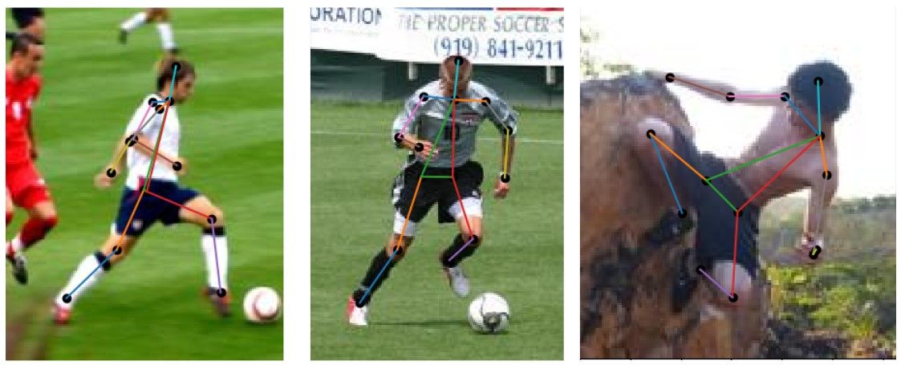

# human-pose-estimation-using-Struct-SVM
  - This is an implementation of the paper on Human Pose Estimation Using Structural Support Vector Machines (https://ieeexplore.ieee.org/document/6130340). In this project, we perform human pose estimation using Struct-SVM's.
  - A human pose skeleton represents the orientation of a person in a graphical format. Essentially, it is a set of coordinates that can be connected to describe the pose of the person.
  - In this implementation, our objective is to correctly identify this set of coordinates (or skeleton) that identify the pose of a person, given the person's input image.
  - Refer to this doc for more info on this project:
    - https://docs.google.com/presentation/d/18-ftoJdxPLsZcftZjlLQE2ZFXV2MlQkVIys1SfGSMJM/edit?usp=sharing
    
# Some results

